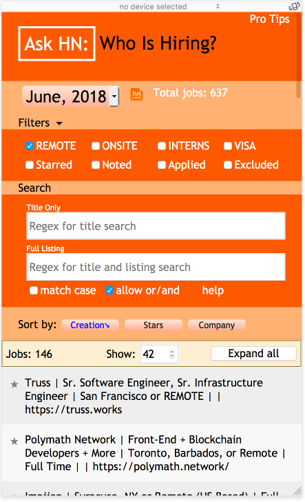

# Hiring (Re)agent

Search and annotate the hundreds of jobs listed every month.

My Javascript/mxWeb&trade; ["AskHN: Who Is Hiring"](https://github.com/kennytilton/whoshiring) browser ported to CLJS/[reagent](https://github.com/reagent-project/reagent), offered FWIW to `reagent` noobs everywhere. A `re-frame` version is [here](https://github.com/kennytilton/rehiring) and a [Matrix](https://github.com/kennytilton/matrix) version is in progress.




Moving along...
* If yer just lookin' for work, the JS version is [live here](https://kennytilton.github.io/whoishiring/) grace a GitHub. Or you can clone this and run it yourself. See below for a devops necessity.
* If ya just want to see this CLJS [reagent](https://github.com/reagent-project/reagent) version of run locally, jump down to "Run Application".
* To be fully empowered such that you can scrape a new month's "Who's Hiring?" replies, jump down to "Grab HN Pages".

### Notable features

#### The progress bar
This was harder than anything. Reactive systems in general resist flowing change out of long-running batch processes such as parsing a big page of HTML. Clever Things(tm) had to be done to structure that work in a way that could fit neatly into the Reagent flow. One hack to note is flushing the DOM so the user actually gets to see something. (I am looking at you, Mac OS X installs.)

#### Persistence
Nothing crazy, but we do demonstrate using `reg-event-fx` to persist user annotations into local storage as they work.

#### Lotsa interdependent widgets
Other than that, just a lot of dynamic UI as the user varies inputs. Note especially that this is not just a browser: user can "star", hide, flag as applied, and record notes on different listings.

### Grab HN Pages
The app runs off pages curl'ed straight from the HN server. So they get out of date (but see below for the script I created to run indefinitely at a specified interval to refresh them).

To grab a page we need the message ID of the actual "Who is hiring" question. We start by visiting HN and tracking down the "Who Is Hiring?" question under `AskHN`. Here is [June, 2018](https://news.ycombinator.com/item?id=17205865). Now checkout the browser URL:
````
https://news.ycombinator.com/item?id=17205865
````
The browser app lives and breathes that `17205865`.

Now we want to pull 1-N pages under that ID because, when the list gets big, HN breaks up the page into multiple pages keyed by a simple `p` parameter. Here is what we curl to get page 2:
````
https://news.ycombinator.com/item?id=17205865&p=2
````
To automate page grabbing I cobbled together a neophyte's bash script we invoke like this (but read on for important prior steps):
````bash
cd rehiring
./grab 17205865
````
An optional second parameter tells the script to wait that many minutes and refresh, until control-C'ed.

I mentioned a prior step. There is no way to know how many pages to scrape, but there is no harm other than wasted bandwidth in guessing high: if we curl too high a `p` (by setting MAX_P too high) we just get the last. So <sob> I edit the `grab` shell script and look for:
````bash
MAX_P=3
````
...and tweak the 3 (or whatever). Now edit `index.html` and look for this:
````js
    <script>
    var gMonthlies = [
        { hnId: "17205865", desc: "June, 2018", pgCount: 1}
        , { hnId: "16967543", desc: "May, 2018", pgCount: 6}
        , { hnId: "16735011", desc: "April, 2018", pgCount: 5}
    ]
    rehiring.core.init();
   </script>
````
Edit reasonably.

Now your copy of the app should work with any new content you specify in `index.html`.

### Run application:

```
lein clean
lein fig:build
```

Figwheel will do some work, then should take you automatically to [http://localhost:9500](http://localhost:9500).

Figwheel will now push cljs changes to the browser.


## Production Build

To compile clojurescript to javascript:

```
lein clean
lein fig:min
```
